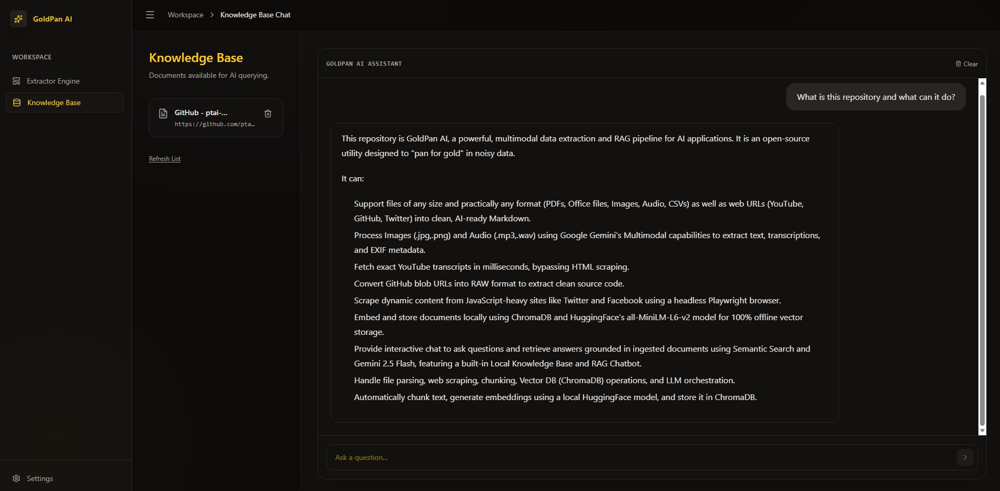

<div align="center">
  
  <br/>
  <h1>GoldPan AI</h1>
  <h3>A Privacy-First, Multimodal Data Extraction and Local RAG Pipeline</h3>
  <p>Seamlessly transform unstructured, massive data files into an AI-ready Knowledge Base.</p>

  <p>
    <a href="https://www.python.org/downloads/"></a>
    <a href="https://nextjs.org/"></a>
    <a href="https://fastapi.tiangolo.com/"></a>
    <a href="https://opensource.org/licenses/MIT"></a>
  </p>
</div>

---

## 📖 Introduction

**GoldPan AI** is an advanced, privacy-first system designed to address the complexities of modern data extraction and Retrieval-Augmented Generation (RAG). By combining highly optimized parallel processing with Google Gemini's multimodal capabilities, GoldPan acts as a unified pipeline capable of extracting, chunking, and embedding virtually any data format into a Local Knowledge Base. 

Whether you are dealing with massive enterprise documents, hours of audio, or dynamic web content, GoldPan AI provides a centralized, intuitive workspace that bridges the gap between raw, unstructured data and actionable AI intelligence.


*(The GoldPan AI Workspace and Knowledge Base Chat Interface)*

## ✨ Core Capabilities

### 1. Universal Format Support & Multimodal Extraction
GoldPan AI is engineered to ingest practically any data format seamlessly:
- **Documents & Text:** PDFs, DOCX, CSVs, TXT, Markdown.
- **Media (Vision & Audio):** High-resolution Images (JPG, PNG) and Audio files (MP3, WAV) are natively supported using Gemini's state-of-the-art multimodal extraction.
- **Web & Dynamic Content:** YouTube videos (direct transcript fetching bypassing HTML scraping), GitHub Blob URLs (automatic conversion to raw code), and dynamic JavaScript-heavy sites via fallback headless browsing.

### 2. Heavy Workload Optimization
Handling large-scale data is a primary design goal.
- **Massive File Support:** The architecture safely processes documents regardless of their size, circumventing traditional LLM context-window limitations.
- **Parallel Processing:** Built-in multi-threading (`ThreadPoolExecutor`) ensures lightning-fast chunking, embedding, and API communication, accelerating extraction processes up to 10x compared to sequential pipelines.

### 3. Integrated Knowledge Base (KB) Workspace
A sophisticated environment for persistent data management:
- **Local Vector Database:** Powered by `ChromaDB`, ensuring all your vectorized knowledge remains strictly local, persistent, and secure.
- **Physical Markdown Storage:** When documents are ingested into the KB, they are also physically saved as clean `.md` files in a centralized `KB/` directory, allowing for external version control and direct human review.
- **Seamless Document Management:** Easily track, review, and delete documents directly from the UI.

### 4. Interactive RAG Chat Assistant
Interact intelligently with your processed data:
- **Context-Aware AI:** Ask complex questions and receive accurate answers grounded *strictly* in the documents you have ingested.
- **Persistent Chat History:** Conversations are saved locally, ensuring continuity across sessions. 
- **Premium UI/UX:** An elegant, "Dark Stone & Gold" aesthetic built with Next.js and TailwindCSS, prioritizing reading space, focus, and modern design principles.

## 🏗️ System Architecture

GoldPan AI operates on a robust decoupled architecture:
- **Backend (FastAPI):** Manages the extraction pipelines (`markitdown`, `trafilatura`, `youtube-transcript-api`), asynchronous HTTP requests, chunking algorithms, and vector embeddings.
- **Frontend (Next.js 14):** Provides an interactive, highly responsive Single Page Application (SPA) with real-time progress tracking, error handling, and chat interfaces.
- **AI Engine:** Utilizes Google Gemini 1.5 Flash for rapid multimodal extraction and Gemini Embedding models for high-dimensional vector representations.

## 🚀 Getting Started

### Prerequisites
- Python 3.10+
- Node.js 18+
- A Google Gemini API Key

### Installation

1. **Clone the repository**
   ```powershell
   git clone https://github.com/ptai-eng/GoldPan.git
   cd GoldPan
   ```

2. **Setup Backend**
   ```powershell
   cd backend
   python -m venv venv
   .\venv\Scripts\activate
   pip install -r requirements.txt
   ```

3. **Setup Frontend**
   ```powershell
   cd ..\frontend
   npm install
   ```

### Running the Application

1. **Start Backend Server**
   ```powershell
   cd backend
   uvicorn main:app --reload --port 8000
   ```

2. **Start Frontend Client**
   ```powershell
   cd ..\frontend
   npm run dev
   ```

3. Open `http://localhost:3000` in your browser. Configure your Gemini API Key in the Settings panel, and begin extracting!

## 📜 License

This project is licensed under the MIT License. See the [LICENSE](LICENSE) file for details.
