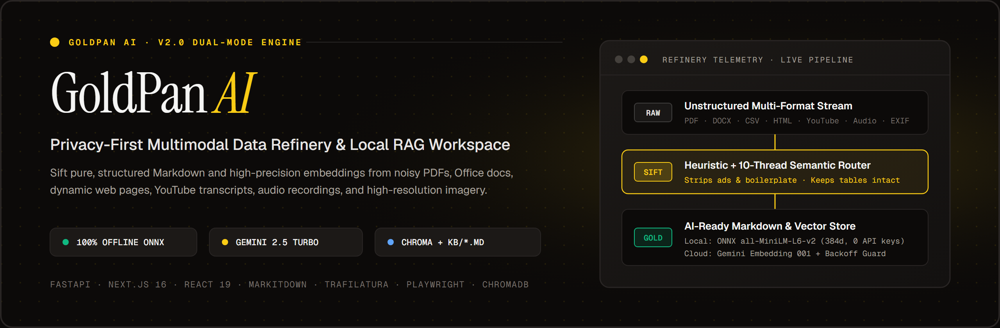
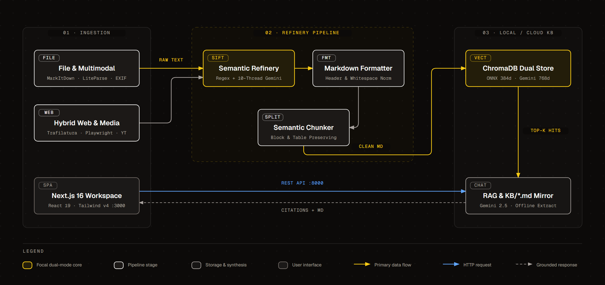
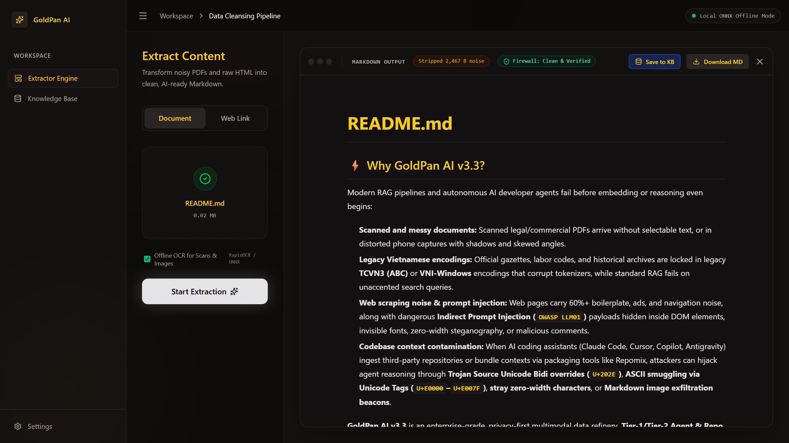
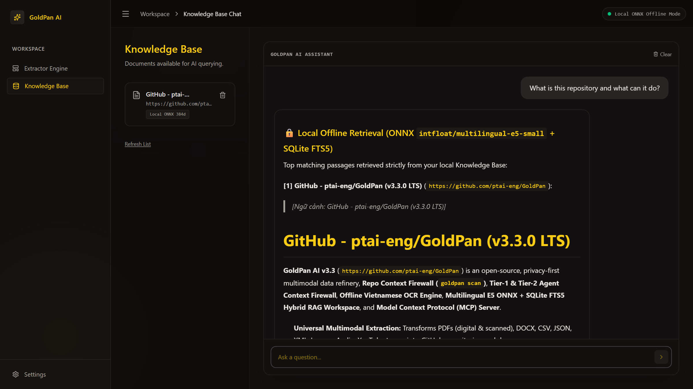

<div align="center">
  
  <br/>
  <br/>

  <p>
    <a href="https://github.com/ptai-eng/GoldPan/actions"></a>
    <a href="https://github.com/ptai-eng/GoldPan/releases/tag/v3.3.0"></a>
    <a href="https://www.python.org/downloads/"></a>
    <a href="https://fastapi.tiangolo.com/"></a>
    <a href="https://nextjs.org/"></a>
    <a href="https://www.trychroma.com/"></a>
    <a href="https://modelcontextprotocol.io/"></a>
    <a href="LICENSE"></a>
  </p>

  <p>
    <a href="#-why-goldpan-ai-v33">Why GoldPan v3.3</a> •
    <a href="#-four-core-pillars-of-goldpan-v33">Four Core Pillars</a> •
    <a href="#-goldpan-bench-empirical-evaluation-triple-track">Benchmarks</a> •
    <a href="#-cli--model-context-protocol-mcp-server">CLI & MCP Server</a> •
    <a href="#-fastapi-rest-api-reference">REST API</a> •
    <a href="#-workspace-tour">Workspace Tour</a> •
    <a href="#-quick-start">Quick Start</a> •
    <a href="#-release-evolution-v10--v330-lts">Release Evolution</a>
  </p>
</div>

---

## ⚡ Why GoldPan AI v3.3?

Modern RAG pipelines and autonomous AI developer agents fail before embedding or reasoning even begins:
- **Scanned and messy documents:** Scanned legal/commercial PDFs arrive without selectable text, or in distorted phone captures with shadows and skewed angles.
- **Legacy Vietnamese encodings:** Official gazettes, labor codes, and historical archives are locked in legacy **TCVN3 (ABC)** or **VNI-Windows** encodings that corrupt tokenizers, while standard RAG fails on unaccented search queries.
- **Web scraping noise & prompt injection:** Web pages carry 60%+ boilerplate, ads, and navigation noise, along with dangerous **Indirect Prompt Injection (`OWASP LLM01`)** payloads hidden inside DOM elements, invisible fonts, zero-width steganography, or malicious comments.
- **Codebase context contamination:** When AI coding assistants (Claude Code, Cursor, Copilot, Antigravity) ingest third-party repositories or bundle contexts via packaging tools like Repomix, attackers can hijack agent reasoning through **Trojan Source Unicode Bidi overrides (`U+202E`)**, **ASCII smuggling via Unicode Tags (`U+E0000`–`U+E007F`)**, **stray zero-width characters**, or **Markdown image exfiltration beacons**.

**GoldPan AI v3.3** is an enterprise-grade, privacy-first multimodal data refinery, **Tier-1/Tier-2 Agent & Repo Context Firewall**, **Offline Vietnamese OCR Engine**, **Multilingual E5 ONNX + SQLite FTS5 Hybrid RAG Workspace**, and **Model Context Protocol (MCP) server** engineered to **sift pure signal ("gold") from untrusted inputs**:

1. **Tier-1, Tier-2 & Repo Context Firewall (`goldpan scan`):** Defends downstream LLMs against prompt injection across static HTML/CSS, **Playwright Tier-2 Computed-Style DOM** (`window.getComputedStyle(el)`), PDF attributes, DOCX vanished runs (`<w:vanish/>`), and **entire source code repositories** (`goldpan scan`). Line-exact findings, zero-width emoji whitelisting (`👨‍👩‍👧‍👦`, `🧑‍💻`), SARIF 2.1.0 export, code profile awareness (`profile="code"` vs `profile="text"`), and direct synergy with packaging tools like Repomix (`goldpan scan . --list-clean | repomix --include -`).
2. **Multilingual & Vietnamese Hybrid RAG Core:** Pairs local **`intfloat/multilingual-e5-small` (384-dim ONNX)** with automatic `"query: "` / `"passage: "` prefixing and a **persistent SQLite FTS5 (`goldpan_fts.db`)** lexical index (`bm25()` with `đ/Đ -> d` diacritic folding, compound bigrams, and atomic chunk deletion), automatic **TCVN3 (ABC) & VNI-Windows -> Unicode NFC** conversion, and a **Hierarchical Breadcrumb Chunker** (`Phần > Chương > Mục > Điều > Khoản`).
3. **Offline Vietnamese OCR & 2D Integral-Image Sauvola Binarization:** Automatically detects scanned PDFs (`< 30` chars/page via `pdfplumber`), rasterizes pages via `pypdfium2`, applies $\mathcal{O}(1)$ **2D Integral-Image Sauvola Local Adaptive Thresholding** to recover crisp text under uneven shadow/lighting gradients, and executes a multi-tier offline OCR fallback chain (`RapidOCR ONNX -> Tesseract vie -> VietOCR -> Builtin Glyph`).
4. **3-Tier Hardware Acceleration & Reproducible `GoldPan Bench` CI Gate:** Hardware-aware ONNX provider routing (`CPUExecutionProvider` INT8, `DmlExecutionProvider` FP32 on AMD Radeon RX 6600 / DirectML, `CoreMLExecutionProvider` on Apple Silicon, `OpenVINOExecutionProvider` on Intel) verified across **Ubuntu, Windows, and macOS** via `goldpan bench --ci-gate` with **95% Wilson Score Confidence Intervals** across Triple-Tracks.

---

## 🏛️ Four Core Pillars of GoldPan v3.3

<div align="center">
  
</div>

### 1. Tier-1, Tier-2 & Repo Context Firewall (`backend/goldpan/firewall/` & `backend/goldpan/scan/`)
- **Tier-1 Static & Binary Steganographic Stripping (`context_firewall.py`):** Parses inline styles and `<style>` blocks (`.class`, `#id`, `[attr]`, CSS variables `color: var(--x); background: var(--x)`) to strip hidden DOM nodes *before* Trafilatura text extraction; filters `<1pt`/white PDF characters and DOCX `<w:vanish/>` runs; removes Unicode Tag (`U+E0000`–`U+E007F`) and Bidi/Zero-Width characters; neutralizes `<|im_start|>`/`[INST]` delimiters; and blocks Markdown image exfiltration beacons.
- **Tier-2 Playwright Computed-Style DOM Firewall (`web_extractor.py`):** Evaluates rendered DOM nodes via `window.getComputedStyle(el)` and `el.getBoundingClientRect()` in headless Chromium/Chrome/Edge to catch stealth payloads hidden via external CSS bundles, zero-opacity layers, `fg === bg` color camouflage, or off-screen transforms (`translate(-9999px)`).
- **Repo Context Firewall (`goldpan scan` & `backend/goldpan/scan/`):** Recursively inspects codebases with `.gitignore` awareness (via `pathspec`), line/column-exact finding telemetry, and zero-width emoji whitelisting (e.g. `👨‍👩‍👧‍👦`, `🧑‍💻`). Operates in `profile="code"` (respecting fenced/inline code syntax) or `profile="text"`, producing SARIF 2.1.0 output for GitHub Code Scanning and providing seamless integration with packaging tools like Repomix (`goldpan scan . --list-clean | repomix --include -`).
- **Context-Aware Semantic Risk Scoring & MCP Data Spotlighting:** Flags imperative override payloads (`risk_score` `0.0–1.0`, `signals`) in English and Vietnamese while distinguishing academic security documentation (Hard Negatives). Supports `<untrusted_document_content source="..." firewall_mode="..." risk_score="...">` wrapping and `_meta.provenance.firewall` telemetry. See [`THREAT_MODEL.md`](THREAT_MODEL.md).

### 2. Multilingual & Vietnamese Hybrid RAG Engine (`backend/goldpan/kb/`)
- **Multilingual E5 ONNX (`onnx_embedder.py`):** Enforces the asymmetric E5 contract (`passage: ...` on indexing, `query: ...` on search) with L2 normalization in isolated collection `goldpan_kb_e5_v3` (plus optional cross-collection Reciprocal Rank Fusion with `Gemini 768d` Matryoshka embeddings).
- **Persistent SQLite FTS5 (`fts_index.py`):** Eliminates $\mathcal{O}(N)$ in-memory corpus rebuilds by persisting `text_nfc` and `text_folded` in `chroma_data/goldpan_fts.db` (`WAL` mode), fusing FTS5 `bm25()` with dense vectors via Reciprocal Rank Fusion (`RRF, k=60`), and atomically purging FTS5 records upon document deletion.
- **Legacy Vietnamese Encoding Decoder (`vn_encoding.py`):** Detects and converts **VNI-Windows**, **TCVN3 (ABC)**, and decomposed **Unicode NFD** into composed **Unicode NFC** at the token level without corrupting English/French prose.
- **Hierarchical Breadcrumb Chunker (`chunker.py`):** Tracks both Markdown (`# H1 > ## H2 > ### H3`) and Vietnamese statutory structure (`Phần > Chương > Mục > Điều > Khoản`), prepending `[Ngữ cảnh: ...]` to every chunk and extracting `so_hieu`, `ngay_ban_hanh`, and `loai_van_ban`.

### 3. Offline Vietnamese OCR & 2D Integral-Image Sauvola Binarization (`backend/goldpan/ocr/`)
- **Automatic Scanned PDF Detection (`pdf_scanner.py`):** Inspects character density per page (`< 30` chars/page threshold) and rasterizes scanned pages at `200 DPI` via `pypdfium2` with strict context-manager file-handle cleanup.
- **2D Integral-Image Sauvola Adaptive Thresholding (`image_preprocess.py`):** Computes local mean $\mu(x,y)$ and standard deviation $\sigma(x,y)$ over a $W \times W$ neighborhood in $\mathcal{O}(1)$ time per pixel using summed-area tables:
  $$T(x, y) = \mu(x, y) \cdot \left[1 + k \cdot \left(\frac{\sigma(x, y)}{R} - 1\right)\right]$$
  Followed by projection-profile deskew (`-5°` to `+5°`) to maximize OCR character accuracy on shadowed phone scans.
- **Multi-Backend Offline Chain (`engine.py`):** Cascades through `RapidOCR (ONNX)` $\rightarrow$ `pytesseract (vie+eng)` $\rightarrow$ `VietOCR` $\rightarrow$ deterministic `builtin_glyph` fallback, exposing OCR confidence and backend telemetry across CLI (`goldpan ocr`), MCP (`goldpan_ocr`), and REST (`/api/ocr`, `/api/extract/file`).

### 4. 3-Tier Hardware-Aware ONNX Acceleration (`goldpan doctor`)

| Tier | Target Hardware | Package / Extra | ONNX Provider & Config | Verification Status |
| :--- | :--- | :--- | :--- | :--- |
| **Tier 1 (Default)** | Any x86_64 / ARM64 CPU | `pip install goldpan` | `CPUExecutionProvider` (`INT8`, `batch_size=32`) | **CI-Verified** (`ubuntu-latest`, `windows-latest`, `macos-latest`) |
| **Tier 2 (Windows GPU)** | **AMD Radeon RX 6600 (RDNA 2)**, **RX 5000 (RDNA 1)**, RX 7000, Intel Arc, NVIDIA DX12 | `pip install "goldpan[directml]"` | `DmlExecutionProvider` (`FP32`, bounded `batch_size=12` + warmup fallback) | **Hardware-Verified** on Windows + AMD RX 6600 (8GB VRAM) |
| **Tier 2 (Apple & Intel)** | **Apple Silicon (M1/M2/M3/M4)** & **Intel Core Ultra / Xeon** | `goldpan[coreml]` / `goldpan[openvino]` | `CoreMLExecutionProvider` (`FP16`) / `OpenVINOExecutionProvider` (`FP16`, `batch_size=16`) | **CI-Verified** (`macos-latest` ARM64 & Provider Selection Suite) |
| **Tier 3 (NVIDIA CUDA)** | NVIDIA CUDA Data Center / Workstation GPUs | `pip install "goldpan[cuda]"` | `CUDAExecutionProvider` (`FP16`, `batch_size=32`) with automatic CPU fallback | **Supported** |

---

## 📊 `GoldPan Bench` Empirical Evaluation (Triple-Track)

Reproduce at any time with `goldpan bench --ci-gate` (dataset SHA-256 hashes verified automatically; see [`BENCHMARK_REPORT.md`](BENCHMARK_REPORT.md)):

### Track B: Multilingual & Vietnamese Hybrid Retrieval (`16` Held-Out Queries across `4` Categories)

| System | Recall@1 (95% Wilson CI) | Recall@3 (95% Wilson CI) | MRR@5 | Avg Latency |
| :--- | :---: | :---: | :---: | :---: |
| **BM25-only (Surface Lexical)** | `50.0%` (`[28.0%, 72.0%]`) | `62.5%` (`[38.6%, 81.5%]`) | `0.5677` | `0.07 ms` |
| **v2.1 (MiniLM-L6 + In-Memory BM25 RRF)** | `68.8%` (`[44.4%, 85.8%]`) | `81.2%` (`[57.0%, 93.4%]`) | `0.7417` | `3.80 ms` |
| **v3.0+ (E5-small ONNX + SQLite FTS5 + Breadcrumb + VNI/TCVN3)** | **`87.5%`** (`[64.0%, 96.5%]`) | **`93.8%`** (`[71.7%, 98.9%]`) | **`0.8958`** | `6.00 ms` |

- **`vi_accented` / `vi_unaccented` / `vi_paraphrase`:** `100.0%` Recall@1 & Recall@3 (`MRR@5 = 1.0000`), including legacy VNI-Windows (`Boä Luaät Lao Ñoäng`) and TCVN3 (`Thông tư 80/2021/TT-BTC`) documents.
- **`cross_lingual_en_vi`:** `75.0%` Recall@3 (`[30.1%, 95.4%]` 95% Wilson CI).

### Track A: Agent Context Firewall (`13` Multi-Vector Attacks + `4` Benign Hard Negatives)

| Metric | Score | 95% Wilson Confidence Interval | Target Gate |
| :--- | :---: | :---: | :---: |
| **Attack Detection Rate (TPR)** | **`100.0%`** | `[77.2%, 100.0%]` | `>= 90.0%` |
| **Payload Sanitization Rate** | **`100.0%`** | `[77.2%, 100.0%]` | `>= 90.0%` |
| **Hard-Negative False Positive Rate (FPR)** | **`0.0%`** | `[0.0%, 49.0%]` | `<= 5.0%` (0% ideal) |
| **Benign Content Preservation Rate** | **`100.0%`** | — | `100.0%` |
| **Firewall Overhead Latency** | **`0.21 ms/doc`** | — | `< 25.0 ms/doc` |

### Track C: Repo Context Firewall (`12` Codebase Attacks + `8` Benign Code/Doc Hard Negatives)

| Metric | Score | 95% Wilson Confidence Interval | Target Gate |
| :--- | :---: | :---: | :---: |
| **Attack Detection Rate (TPR)** | **`100.0%`** | `[75.8%, 100.0%]` | `>= 95.0%` |
| **Hard-Negative False Positive Rate (FPR)** | **`0.0%`** | `[0.0%, 32.4%]` | `<= 0.0%` (0% ideal) |
| **Firewall Scan Latency** | **`1.77 ms/file`** | — | `< 10.0 ms/file` |

---

## 🧰 CLI & Model Context Protocol (MCP) Server

### 1. Command-Line Interface (`goldpan`)

```powershell
# Install GoldPan v3.3 (add [directml] on Windows DX12 GPUs, [ocr] for RapidOCR + pypdfium2, or [all])
pip install -e .
# pip install -e ".[all]"

# 1. Diagnose hardware execution provider, warmup latency, OCR engine, SQLite FTS5 & v2->v3 migration
goldpan doctor

# 2. Scan repository/directory for prompt injection vectors, Trojan Source & ASCII smuggling
goldpan scan . --profile code --fail-on-risk 0.70

# 3. List verified clean files for seamless Repomix integration (context packaging)
goldpan scan . --list-clean > clean_files.txt
# repomix --include "$(cat clean_files.txt)"

# 4. Export security findings to standard SARIF 2.1.0 for GitHub Code Scanning
goldpan scan . --format sarif --output results.sarif

# 5. Extract clean Markdown protected by the Agent Context Firewall (sanitize | audit | strict)
goldpan extract https://example.com --firewall-mode sanitize --spotlight

# 6. Run standalone Offline Vietnamese OCR on a scanned PDF or image
goldpan ocr ./scan_hop_dong.pdf --json

# 7. Ingest documents into the v3 Multilingual E5 + SQLite FTS5 Knowledge Base
goldpan ingest ./luat_so_huu_tri_tue.pdf --local

# 8. Hybrid RRF search (supports accented, unaccented, paraphrased & cross-lingual queries)
goldpan search "dieu 15 luat so huu tri tue khong bao ho quyen tac gia" --top-k 4

# 9. List all indexed documents in ChromaDB + SQLite FTS5
goldpan kb-list

# 10. Delete a document and its physical KB/*.md mirror
goldpan kb-delete <document_uuid>

# 11. Re-index / migrate existing KB/*.md or v2 chunks into v3 E5 + SQLite FTS5
goldpan reindex

# 12. Audit all indexed Knowledge Base chunks for prompt injection signatures
goldpan audit

# 13. Run the reproducible Triple-Track Benchmark & CI Regression Gate
goldpan bench --ci-gate --output-md BENCHMARK_REPORT.md
```

### 2. MCP Server (`goldpan-mcp`) for AI Coding Agents

Register `goldpan-mcp` in **Claude Desktop**, **Claude Code**, **Cursor**, or **Antigravity**:

```json
{
  "mcpServers": {
    "goldpan": {
      "command": "C:/path/to/GoldPan/venv/Scripts/goldpan-mcp.exe",
      "args": [],
      "env": {
        "GEMINI_API_KEY": ""
      }
    }
  }
}
```

| MCP Tool | Arguments | Description |
| :--- | :--- | :--- |
| `goldpan_extract` | `source`, `detail="summary"`, `max_chars=4000`, `ingest_to_kb=false`, `firewall_mode="sanitize"`, `spotlight=false` | Extracts clean Markdown protected by Tier-1/Tier-2 Agent Context Firewall with `_meta.provenance.firewall` telemetry. |
| `goldpan_scan_repo` | `path="."`, `mode="audit"`, `profile="code"`, `detail="summary"`, `max_tokens=4000` | Scans entire repository for codebase prompt injection, Trojan Source bidi, ASCII smuggling, and exfil beacons with `_meta.provenance.firewall` telemetry. |
| `goldpan_ocr` | `source`, `dpi=200`, `spotlight=true` | Runs Offline Vietnamese OCR (Sauvola 2D adaptive binarization + `RapidOCR`/`Tesseract`/`VietOCR`) on scanned PDFs or images. |
| `goldpan_kb_ingest` | `markdown`, `title`, `source`, `prefer_local=true` | Chunks with `HierarchicalBreadcrumbChunker`, indexes into `goldpan_kb_e5_v3` + SQLite FTS5, and saves `KB/*.md`. |
| `goldpan_kb_search` | `query`, `n_results=4`, `detail="summary"`, `spotlight=false` | Runs Hybrid RRF search across Multilingual E5 (384d), SQLite FTS5 BM25, and Gemini (768d). |
| `goldpan_kb_audit` | *(none)* | Scans all indexed chunks in the Knowledge Base using `AgentContextFirewall(mode="audit")`. |
| `goldpan_doctor` | *(none)* | Returns hardware execution provider tier, warmup latency, OCR backend status, FTS5 health, and v2->v3 migration status. |
| `goldpan_kb_list` | *(none)* | Lists all indexed documents, titles, sources, and chunk counts. |
| `goldpan_kb_delete` | `document_id` | Atomically deletes a document's vectors, SQLite FTS5 BM25 entries, and physical `KB/*.md` file. |

---

## 🌐 FastAPI REST API Reference

GoldPan serves an enterprise FastAPI backend on port `8000`:

| Method | Endpoint | Description |
| :--- | :--- | :--- |
| `GET` | `/health` | Health check returning API status and version (`v3.3.0`). |
| `POST` | `/api/extract/url` | Scrapes web URL, runs Tier-1/Tier-2 Context Firewall, and returns cleaned Markdown. |
| `POST` | `/api/extract/file` | Extracts documents (`.pdf`, `.docx`, `.xlsx`, `.pptx`, `.html`, images) with OCR fallback. |
| `POST` | `/api/kb/ingest` | Chunks and indexes Markdown into Multilingual E5 + SQLite FTS5. |
| `POST` | `/api/kb/search` | Performs Hybrid RRF search across E5 vector embeddings and SQLite FTS5 lexical index. |
| `GET` | `/api/kb/list` | Returns list of all indexed documents in the Knowledge Base. |
| `DELETE`| `/api/kb/delete/{id}` | Deletes document vectors, FTS5 rows, and physical `KB/*.md` file. |
| `POST` | `/api/ocr` | Standalone Vietnamese & multilingual OCR endpoint for scanned PDFs and images. |
| `GET` | `/api/doctor` | Returns hardware execution provider, ONNX warmup latency, and collection stats. |
| `GET` | `/api/audit` | Audits all indexed Knowledge Base chunks for prompt injection signatures. |

---

## 🖥️ Workspace Tour

Built with **Next.js 16**, **React 19**, **Tailwind CSS v4**, and **Framer Motion** in a high-contrast **Dark Stone & Gold (`#0C0A09` / `#FACC15`)** theme with live **Agent Context Firewall** badges and **Offline Vietnamese OCR** controls.

### 1. Data Cleansing & Context Firewall Extractor (`assets/workspace-extractor.png`)


### 2. Local Hybrid RAG Knowledge Base (`assets/workspace-rag-chat.png`)


---

## 🚀 Quick Start

```powershell
git clone https://github.com/ptai-eng/GoldPan.git
cd GoldPan

# Create virtual environment
python -m venv venv
.\venv\Scripts\activate

# Install GoldPan and optional acceleration extras
pip install -r requirements.txt
pip install -e ".[dev,ocr,directml]"

# Run all 17 verification, security, Offline OCR, Playwright DOM Firewall & benchmark suites
.\venv\Scripts\python.exe run_tests.py
.\venv\Scripts\python.exe -m pytest backend/tests/ -v
```

To launch the full interactive workspace (`FastAPI` on `:8000` + `Next.js 16` on `:3000`):

```powershell
# Terminal 1 — FastAPI Backend
.\venv\Scripts\python.exe -m uvicorn backend.main:app --reload --port 8000

# Terminal 2 — Next.js 16 Frontend
cd frontend
npm install
npm run dev
```

---

## 🏁 Release Evolution (`v1.0` $\rightarrow$ `v3.3.0` LTS)

- **`v1.0` — Foundation:** Multimodal extraction pipeline (`MarkItDown`, `Trafilatura`, `LiteParse`), heuristic boilerplate filtering, and ChromaDB vector storage.
- **`v2.0` & `v2.1.1` — Hybrid RAG & MCP Server:** Added JSON-RPC 2.0 MCP Server (`goldpan-mcp`), Typer CLI (`goldpan`), Dual-Mode Embeddings (`Local ONNX 384d` + `Gemini 768d` MRL), and Reciprocal Rank Fusion (`RRF`).
- **`v3.0.0` — Multilingual E5, SQLite FTS5 & Agent Context Firewall:** Upgraded dense retrieval to `intfloat/multilingual-e5-small` (`query:` / `passage:`), persistent SQLite FTS5 (`WAL` mode + Vietnamese diacritic folding), `TCVN3`/`VNI-Windows` decoding, `HierarchicalBreadcrumbChunker`, Tier-1 `AgentContextFirewall`, 3-Tier GPU Diagnostics (`goldpan doctor`), and `GoldPan Bench` (`--ci-gate`).
- **`v3.1.0` — Offline Vietnamese OCR & Tier-2 Silicon Acceleration:** Added `goldpan.ocr` (`is_scanned_pdf`, 2D Integral-Image Sauvola Adaptive Binarization, `RapidOCR`/`Tesseract`/`VietOCR` fallback chain), `goldpan_ocr` MCP tool, and Tier-2 `CoreMLExecutionProvider` (Apple Silicon) + `OpenVINOExecutionProvider` (Intel) support.
- **`v3.2.0` (Production LTS) — Playwright Tier-2 DOM Firewall & Cross-Platform CI:** Added headless Playwright `window.getComputedStyle(el)` + `<style>` AST DOM sanitization, atomic FTS5 chunk deletion, Next.js 16 Playwright E2E suite, GitHub contributor templates, and 100% green CI across `ubuntu-latest`, `windows-latest`, and `macos-latest`.
- **`v3.3.0` (Current Release) — Repo Context Firewall (`goldpan scan`), SARIF 2.1.0 & Triple-Track Benchmark:** Added codebase prompt injection scanning (`CodeScanner`, `RepoWalker` with `.gitignore` via `pathspec`), line/column-exact finding telemetry, zero-width emoji whitelisting (`👨‍👩‍👧‍👦`, `🧑‍💻`), non-destructive sanitization (`--out-dir`), SARIF 2.1.0 output for GitHub Code Scanning, 9th MCP tool `goldpan_scan_repo`, Repomix integration (`--list-clean`), and Track C Benchmark gate (TPR 100%, FPR 0%).
- **Future Horizons (`v4.0` Exploration Ideas):** Optional local Whisper ONNX audio transcription (`goldpan[asr]`), entity-linked GraphRAG over statutory cross-references, and containerized Docker Compose deployment profiles.

---

## 📜 License

Released under the [MIT License](LICENSE). Crafted with passion by **[Hoang Kim Phat Tai (ptai-eng)](https://github.com/ptai-eng)**.
